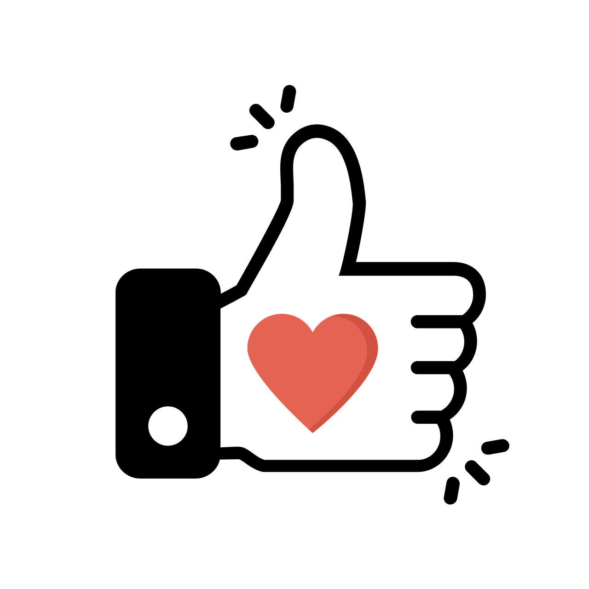

### <b>YouTube Auto Like</b>

    
      
    
    
    
    
    
    

Language: <a href="readme.md">EN-US</a>

Eu tenho o hábito de clicar no botão de Like em todos os vídeos do YouTube que eu assisto. E como eu não quero mais ficar fazendo isso manualmente, eu criei uma extensão que faz isso para mim. Sim, eu quero deixar o Like, sem precisa ficar clicando nele manualmente 😀

Para instalar a extensão em seu Google Chrome, basta fazer download dela, e instalá-la manualmente. Se você não sabe instalar uma extensão manualmente, dê uma pesquisada rápida no Google que você resolverá isso rapidamente.

 

:smiley: Autor
---

Patrocinar: [melchisedech333](https://github.com/sponsors/melchisedech333) 
YouTube: [Melchisedech](https://www.youtube.com/channel/UC4Sh4wxncr5arnydpUfWPKw) 
Twitter: [Melchisedech333](https://twitter.com/Melchisedech333) 
Blog: [melchisedech333.github.io](https://melchisedech333.github.io/) 
LinkedIn: [Melchisedech Rex](https://www.linkedin.com/in/melchisedech-rex-724152235/)

 

:scroll: Licença
---

[ BSD-3-Clause license](./license)

Remember to give me a pretty little star  :star_struck:

