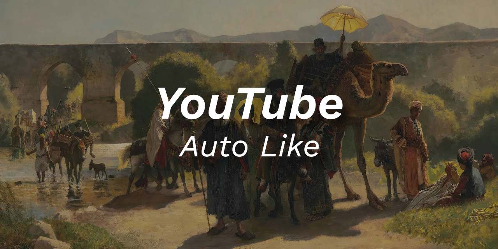

 

    
      
    
    
    
    
    
    

Language: <a href="readme-pt.md">PT-BR</a>

I have the habit of clicking the Like button on every YouTube video I watch. And since I don't want to do that anymore, I made an extension that does that for me. Yes, I want to leave the Like, without having to manually click on the Like button 😀

To install this extension on your Google Chrome, you must download it, and then install it manually. If you don't know how to install an extension manually, just do a quick Google search and you'll find out soon enough.

 

:smiley: Author
---

Sponsor: [melchisedech333](https://github.com/sponsors/melchisedech333) 
Twitter: [Melchisedech333](https://twitter.com/Melchisedech333) 
LinkedIn: [Melchisedech Rex](https://www.linkedin.com/in/melchisedech-rex-724152235/) 
Blog: [melchisedech333.github.io](https://melchisedech333.github.io/) 

 

:scroll: License
---

[ BSD-3-Clause license](./license)

  

## Remember to give me   a beautiful little star :star_struck:

